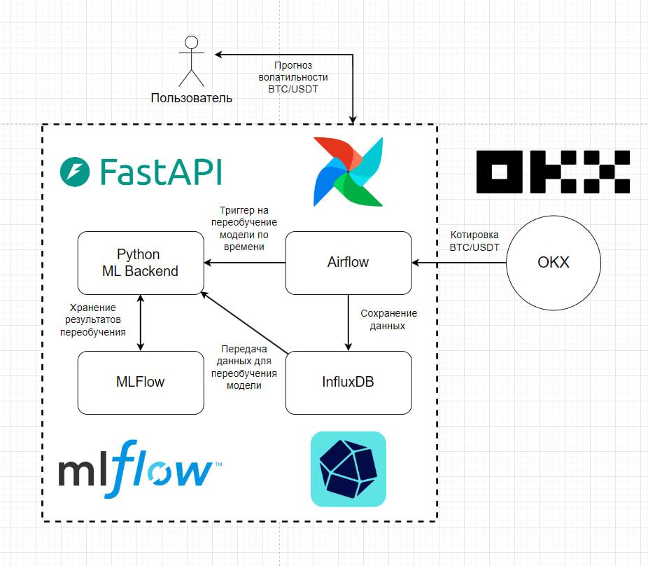

# Volatility-Forecasting-BTC

Данная система предоставляет возможность прогнозирования волатильности и круса биткойна с помощью статистики (**ARCH**, **GARCH**), машинного обучения (**SVR**, **KNN**, **LightGBM**) и глубокого обучения (**NLinear**, **DLinear**, **KAN**, **NBEATS**, **LSTM**). Система имеет графический интерфейс на streamlit, а процес прогнозирования и получения данных полностью автоматизирован, данные хранятся в InfluxDB. Развёртывание системы происходит через Docker-compose.

## Способы запуска

Для запуска используйте скрипты `start.bash` (для Windows) или `start.sh` (для Linux)

Для ручного запуска воспользуйтесь этой последовательностью комманд:

* `docker-compose up airflow-init -d`
* `docker-compose up -d`

## Основные компоненты системы

